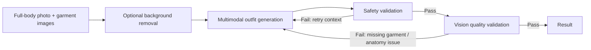

# Try-On-Me

> AI-powered multi-garment virtual styling pipeline

Try-On-Me began as a university virtual try-on project based on VITON-HD. v2 is a clean rebuild for current multimodal generation workflows: it accepts a full-body photograph plus one or more fashion references, produces a styled image, and validates it before showing it to the user.

## v1 → v2

The previous Angular app, VITON-HD integration, authentication, community, closet, product management, shopping search, polling, and external localhost API dependencies have been removed. v2 has no database or account system; its focus is the AI workflow.

## Workflow



The pipeline is deliberately split into preprocessing, generation, safety, quality, and orchestration responsibilities. Quality validation checks person preservation, anatomy, full clothing, and every requested garment category. Validation failures become retry context for the next generation. `MAX_GENERATION_RETRIES` defaults to `3` (three retries after the initial attempt).

## Input and output

Required: one full-body person image. Optional but at least one required: `top`, `bottom`, `outer`, `shoes`, `hat`, and `accessory`. The client and API both enforce these rules. `POST /api/generate` accepts multipart form data and returns a JSON response such as:

```json
{ "status": "completed", "result_url": "/api/results/<id>", "retry_count": 0 }
```

The MVP holds returned image bytes in process memory only; restarting the backend clears results.

## Architecture

```text
frontend/                         React + Vite + TypeScript studio
backend/app/api/generation.py     Multipart API and ephemeral result endpoint
backend/app/pipeline/             Retry orchestration
backend/app/services/             Provider-agnostic domain services
backend/app/providers/            Background, generation, moderation, vision adapters
backend/tests/                    Pipeline and request validation tests
```

The provider interfaces isolate external services:

- `BackgroundRemovalProvider` → `BackgroundRemover`
- `ImageGenerationProvider` → `OutfitGenerator`
- `ModerationProvider` → `SafetyValidator`
- `VisionValidationProvider` → `QualityValidator`

`mock` is the default for every provider so the application runs end-to-end without credentials. The mock image generator returns the person image unchanged and the mock moderation/vision validators approve it. They are development scaffolding only and are explicitly **not production-safe**. Add real provider adapters under `backend/app/providers/` and select them through environment configuration before deployment.

## Run locally

Use two terminals from the repository root.

```bash
python -m venv .venv
source .venv/bin/activate
pip install -r backend/requirements.txt
cd backend && uvicorn app.main:app --reload --port 8000
```

```bash
cd frontend
npm install
npm run dev
```

Open `http://localhost:5173`. To point the frontend to a deployed API, set `VITE_API_BASE_URL` in `frontend/.env.local`.

## Environment

Copy `.env.example` to `backend/.env` and change provider selections when real adapters are available:

```env
IMAGE_GENERATION_PROVIDER=mock
VISION_PROVIDER=mock
BACKGROUND_REMOVAL_PROVIDER=mock
MODERATION_PROVIDER=mock
MAX_GENERATION_RETRIES=3
```

No API keys are committed or exposed to browser code. The legacy repository contained Naver credentials in its former frontend and proxy configuration; those files were removed. Because credentials may remain in Git history, revoke and reissue them before any further use rather than rewriting history blindly.

## Test and build

```bash
cd backend && pytest
cd frontend && npm run build
```

## Known limits and next steps

- The current mock mode does not perform real background removal, generation, moderation, or vision validation.
- Results are temporary and are not persisted.
- Production work should add authenticated, provider-specific adapters; strong image moderation; source-image quality checks; object storage with retention rules; and progress delivery via SSE or polling.
